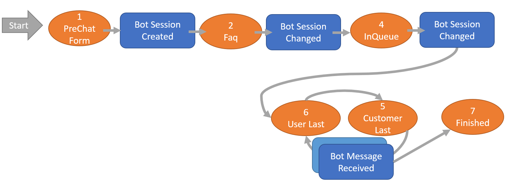

# Echobot 2

A simple chatbot.

The difference with `Echobot` is that here we allow the pre-chat form and FAQ to happen before the bot takes over the chat.

## Installation

1. Create a CrmScript folder named 'Echo2'.
2. Place the 4 CrmScripts into the folder.
3. The presence of a script named  `...bot register...` signals the existence of a chatbot in the folder.
4. Go to the Chat admin and open a chat topic.
5. Go to the Chatbot tab and enable the chatbot.
6. Choose the "Echo2" folder from the list, and name the chatbot.
7. Save the chat topic.

## What Happens

### Bot Registration

When the chat channel (aka topic) is configured and saved, the `...bot register...` script is called.
The CrmScript folder is scanned for additional scripts, and the ones with recognized names are noted.

### Session Created

The `...bot session created...` script is called. This happens before the FAQ or pre-chat forms are shown. The initial state of the session
depends on the options configured on the topic. 

The echobot2 checks to see if we have gone straight to the queue - which means there is no pre-chat form or FAQ configured.

### Session Changed

When the session changes state to 4 (in-queue) - then the pre-chat form and faq are done. This is the point
where a bot can start talking to the user.

### Message Received

When the user posts a message to the channel, and the bot is active, then the script called
`...bot message received...` is called.

If the session has not yet reached the queue state, then the bot must ignore its input.
Let the default processing handle the message.